# 🛠️ Tech Assignment: Construction HRMS — Overtime & Tickets

## 🏠 System Overview & Validation Logic

Instead of relying on basic input forms, I implemented a robust, secure data validation architecture. The visual below demonstrates the full-stack flow of the new Overtime feature, highlighting the strict "60-Hour Monthly Cap" check which I engineered to execute directly in the database (via Sequelize aggregate functions) rather than inefficiently summing records in the application memory.



---

## 🛠️ Zero-Friction Setup Instructions

To respect your time during the review process, I have fully containerized the database setup. You do not need to manually configure MySQL or run schema scripts.

1.  **Docker:** Ensure **Docker Desktop** (or the Docker daemon) is running.
2.  **Database Spin-up:** From the root directory, run:
    ```bash
    docker-compose up -d
    ```
    _(This instantly spins up a MySQL 8 container mapped to port 3306 with the required credentials)._
3.  **Backend Setup:** Open a terminal window:
    ```bash
    cd Backend
    npm install
    npm start
    ```
    _(Note: On startup, the Node server automatically connects to the database, syncs the Sequelize models, and bootstraps the new `designation` column)._
4.  **Frontend Setup:** Open a second terminal window:
    ```bash
    cd Frontend
    npm install
    npm run dev
    ```

---

## 🤖 AI Usage & Development Strategy

I utilized an agentic workflow (Antigravity/Claude agent framework) combined with Gemini to accelerate this assignment, specifically for scaffolding React boilerplate and Yup/Zod form validation schemas.

However, I employed **strict manual engineering oversight** and negative prompting to steer the architecture and prevent AI hallucinations:

- **Sequelize Pattern Enforcement:** I forced the agent to read persistent Markdown memory files (`STATE.md`, `ARCHITECTURE.md`) mapping the Sequelize architecture before writing a single route, ensuring it didn't use incorrect raw SQL queries.
- **Database-First Aggrigation:** For the 60-Hour Rule, I actively rejected the AI's initial attempt to fetch all user records to the Node server to calculate the sum. I steered it to write an optimized Sequelize `sum()` aggregate query, preventing major performance/memory leaks at scale.

---

## 📝 Engineering Notes, Tickets & Deviations

### ✅ Part 1: The Overtime Feature

Implemented secure, end-to-end logging for site managers. The system enforces policy strictly: only 1-6 hours allowed per day, dates limited to +/- 7 days, and a rigid 60-hour cap per worker per month, all validated on both the React client and the Express backend before a Sequelize create operation.

### 🐛 LF-101 & LF-102: Payslip Formatting & Negative Salary Bug

- **Date Formatting:** Silently updated payslip print views to render printed dates as `DD/MM/YYYY` using `Intl.DateTimeFormat('en-IN')` in `PrintPdfSlipGaji` and `PrintPdfDataGajiPegawai`, adhering strictly to standard Indian date rendering without installing external date libraries.
- **Negative Salary:** Salary entries live in the `DataJabatan` flow in this repo. I added `min='0'` on the frontend forms and implemented a strict backend check to return `400 Bad Request` if `gaji_pokok < 0`.

### 🐛 LF-103: Worker Designation Field

Rather than requiring the reviewer to run a manual SQL `ALTER TABLE` command, I updated the Sequelize synchronization flow in the backend models to **automatically bootstrap** the new `designation` column on server startup.

### 🐛 LF-104: CSV Export for Employee List

I opted to handle this entirely on the client-side (Frontend) using a vanilla JavaScript `Blob` flow. This avoids adding a new, unnecessary backend route for file streaming, reducing server load. I included a UTF-8 BOM so the file opens flawlessly in Microsoft Excel without character mangling.

### 🐛 LF-105: Fix Mobile Layout

Adjusted the employee list table in `Frontend/src/pages/Admin/MasterData/DataPegawai/index.jsx` so the main data table sits inside a responsive `div` with `overflow-x-auto`. This locks the main page layout on mobile devices while allowing the user to swipe left and right strictly on the table to see cut-off columns like salary, vastly improving user experience for site managers.
